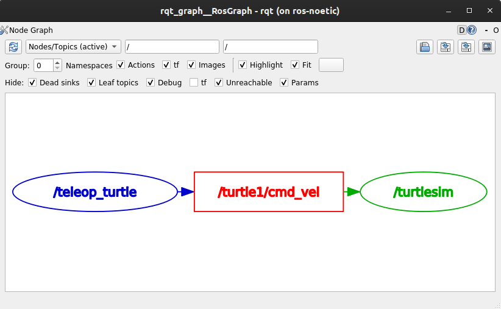
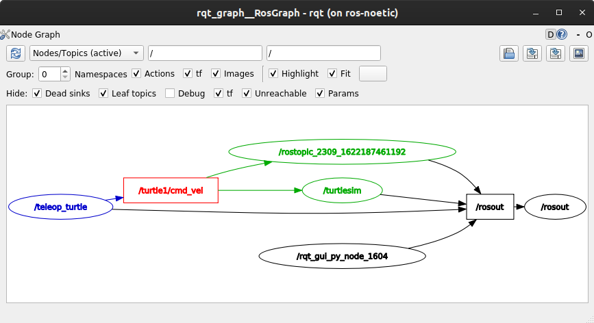

# Understanding ROS topics

**Goal**: Use rqt_graph and command line tools to introspect ROS topics.

## Background

ROS breaks complex systems down into many modular nodes. Topics are a vital element of the ROS graph that act as a bus for nodes to exchange messages.


A node may publish data to any number of topics and simultaneously have subscriptions to any number of topics.


Topics are one of the important ways that data moves between nodes, and therefore between different parts of the system.

## Prerequisites

As always, don’t forget to source ROS 2 in every new terminal you open. Run `roscore` in a separate terminal.

## Tasks

### 1 Setup

By now you should be comfortable starting up turtlesim.

Open a new terminal and run:

```bash
rosrun turtlesim turtlesim_node
```

Open another terminal and run:
```bash
rosrun turtlesim turtle_teleop_key
```

Recall from the [previous tutorial] that the names of these nodes are `/turtlesim` and `/teleop_turtle` by default.

### 2 rqt_graph

Throughout this tutorial, we will use `rqt_graph` to visualize the changing nodes and topics, as well as the connections between them.

To run rqt_graph, open a new terminal and enter the command:

```bash
rqt_graph
```

You can also open `rqt_graph` by opening rqt and selecting **Plugins** > **Introspection** > **Nodes Graph**.



You should see the above nodes and topic. If you hover your mouse over the topic in the center, you’ll see the color highlighting like in the image above.

The graph is depicting how the `/turtlesim` node and the `/teleop_turtle` node are communicating with each other over a topic. The `/teleop_turtle` node is publishing data (the keystrokes you enter to move the turtle around) to the `/turtle1/cmd_vel` topic, and the `/turtlesim` node is subscribed to that topic to receive the data.

The highlighting feature of **rqt_graph** is very helpful when examining more complex systems with many nodes and topics connected in many different ways.

`rqt_graph` is a graphical introspection tool. Now we’ll look at some command line tools for introspecting topics.

### rostopic list

Running the `rostopic list` command in a new terminal will return a list of all the topics currently active in the system:

```bash
/rosout
/rosout_agg
/statistics
/turtle1/cmd_vel
/turtle1/color_sensor
/turtle1/pose
```

Topics have names and types. These attributes, particularly the type, are how nodes know they’re talking about the same information as it moves over topics. To show the topic type run this command:

```bash
rostopic type /turtle1/cmd_vel 
```

```bash
geometry_msgs/Twist
```

If you’re wondering where all these topics are in rqt_graph, you can uncheck all the boxes under Hide:


For now, though, leave those options checked to avoid confusion.

### 4 rostopic echo

To see the data being published on a topic, use:

```bash
rostopic echo <topic_name>
```

Since we know that `/teleop_turtle` publishes data to `/turtlesim` over the `/turtle1/cmd_vel` topic, let’s use echo to introspect on that topic:

```bash
rostopic echo /turtle1/cmd_vel
```

At first, this command won’t return any data. That’s because it’s waiting for `/teleop_turtle` to publish something.

Return to the terminal where `turtle_teleop_key` is running and use the arrows to move the turtle around. Watch the terminal where your `echo` is running at the same time, and you’ll see position data being published for every movement you make:

```bash
linear: 
  x: 2.0
  y: 0.0
  z: 0.0
angular: 
  x: 0.0
  y: 0.0
  z: 0.0
---
```

Now return to rqt_graph and uncheck the Debug box.



`/rostopic_2309_1622187461192` is the node created by the `echo` we just ran (the number will change). Now you can see that the publisher is publishing data over the `cmd_vel` topic, and two subscribers are subscribed.

### 5 rostopic info

Topics don’t have to only be point-to-point communication; it can be one-to-many, many-to-one, or many-to-many.

Another way to look at this is running:

```bash
rostopic info /turtle1/cmd_vel
```

Which will return:

```bash
Type: geometry_msgs/Twist

Publishers: 
 * /teleop_turtle (http://ros-noetic:44037/)

Subscribers: 
 * /turtlesim (http://ros-noetic:44297/)
 * /rostopic_2309_1622187461192 (http://ros-noetic:45255/)
```

### 6 rosmsg show

Nodes send data over topics using messages. Publishers and subscribers must send and receive the same type of message to communicate.

The topic types we saw earlier after running `rostopic type <topic-name>` let us know what type of messages each topic can send. Recall that the `cmd_vel` topic has the type:

```bash
geometry_msgs/Twist
```

This means that in the package `geometry_msgs` there is a message called `Twist`.

Now we can run `rosmsg show <type>.msg on this type to learn its details, specifically, what structure of data the message expects.

```bash
rosmsg show geometry_msgs/Twist
```

```bash
geometry_msgs/Vector3 linear
  float64 x
  float64 y
  float64 z
geometry_msgs/Vector3 angular
  float64 x
  float64 y
  float64 z
```

This tells you that the `/turtlesim` node is expecting a message with two vectors, `linear` and `angular`, of three elements each. If you recall the data we saw `/teleop_turtle` passing to `/turtlesim` with the `echo` command, it’s in the same structure:

```bash
linear: 
  x: 2.0
  y: 0.0
  z: 0.0
angular: 
  x: 0.0
  y: 0.0
  z: 0.0
---
```

### rostopic pub

Now that you have the message structure, you can publish data onto a topic directly from the command line using:

```bash
rostopic pub <topic_name> <msg_type> '<args>'
```

The `'<args>'` argument is the actual data you’ll pass to the topic, in the structure you just discovered in the previous section.

It’s important to note that this argument needs to be input in YAML syntax. Input the full command like so:

```bash
rostopic pub -1 /turtle1/cmd_vel geometry_msgs/Twist "{linear: {x: 2.0, y: 0.0, z: 0.0}, angular: {x: 0.0, y: 0.0, z: 1.8}}"
```

`-1` is an optional argument meaning "publish one message then exit".

You will receive the following message in the terminal:

```bash
publishing and latching message for 3.0 seconds
```

And you will see your turtle move like so:


The turtle (and commonly the real robots which it is meant to emulate) require a steady stream of commands to operate continuously. So, to get the turtle to keep moving, you can run:

```bash
rostopic pub -r 1 /turtle1/cmd_vel geometry_msgs/Twist "{linear: {x: 2.0, y: 0.0, z: 0.0}, angular: {x: 0.0, y: 0.0, z: 1.8}}"
```

The difference here is the removal of the `-1` option and the addition of the `--rate 1` option, which tells `rostopic pub` to publish the command in a steady stream at 1 Hz.


You can refresh **rqt_graph** to see what’s happening graphically. You will see the `rostopic pub ... ` node (`/rostopic_3050_1622189437717`) is publishing over the `/turtle1/cmd_vel` topic, and is being received by both the `rostopic echo ... ` node (`/rostopic_2309_1622187461192`) and the `/turtlesim node` now.


Finally, you can run `echo` on the `pose` topic and recheck rqt_graph:

```bash
rostopic echo /turtle1/pose
```


In this case, `/turtlesim` is now publishing to the `pose` topic, and a new `echo` node is subscribed.

### 8 rostopic hz

For one last introspection on this process, you can report the rate at which data is published using:

```bash
rostopic hz /turtle1/pose 
```

It will return data on the rate at which the `/turtlesim` node is publishing data to the `pose` topic.

```bash
average rate: 62.527
	min: 0.015s max: 0.017s std dev: 0.00041s window: 62
```

Recall that you set the rate of `turtle1/cmd_vel` to publish at a steady 1 Hz using `rostopic pub -r 1`. If you run the above command with `turtle1/cmd_vel` instead of `turtle1/pose`, you will see an average reflecting that rate.

### 9 Clean up

At this point you’ll have a lot of nodes running. Don’t forget to stop them, either by closing the terminal windows or entering `Ctrl+C` in each terminal.

## Summary

Nodes publish information over topics, which allows any number of other nodes to subscribe to and access that information. In this tutorial you examined the connections between several nodes over topics using rqt_graph and command line tools. You should now have a good idea of how data moves around a ROS system.

---