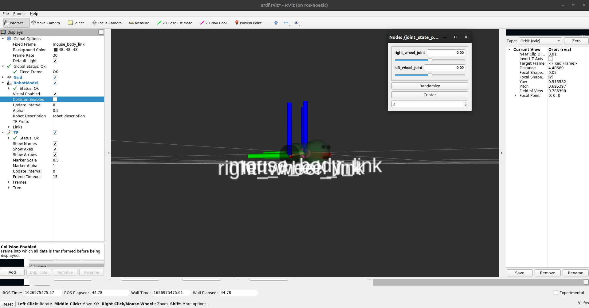
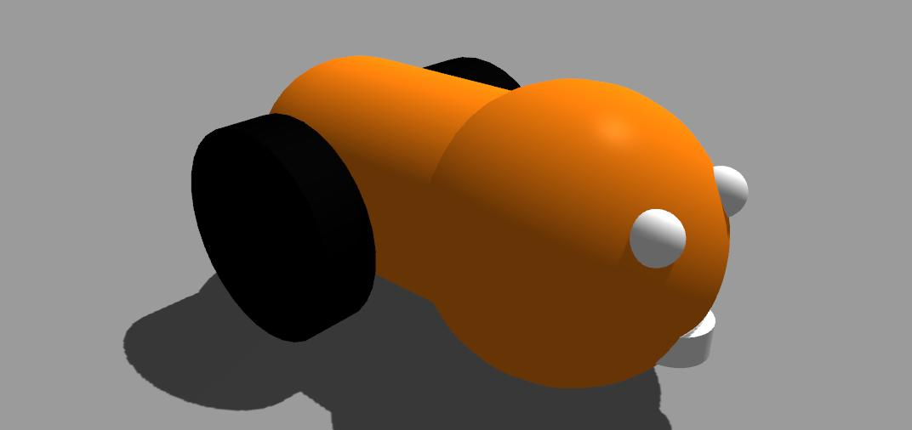

# Creating your own Micromouse


- Create a new xacro file in `urdf` folder of `micromouse` package.

    ```bash
    roscd micromouse
    touch urdf/micromouse_bot.urdf.xacro
    touch urdf/micromouse_bot.gazebo
    ```

    `micromouse_bot.urdf.xacro`

    ```xml
    <?xml version="1.0"?>
    <robot name="micromouse" xmlns:xacro="https://www.ros.org/wiki/xacro">

        <!-- Import all Gazebo-customization elements, including Gazebo colors -->
        <xacro:include filename="$(find micromouse)/urdf/micromouse_bot.gazebo" />

        <material name="green">
            <color rgba="0.2 0.4 0.2 1.0"/>
        </material>

        <material name="black">
            <color rgba="0.0 0.0 0.0 1.0"/>
        </material>

        <xacro:property name="rotate" value="1.57079632679"/>
        <xacro:property name="head_radius" value="0.025"/>
        <xacro:property name="body_radius" value="0.020"/>
        <xacro:property name="body_length" value="0.05"/>

        <xacro:macro name="default_inertial">
            <inertial>
                <mass value="0.001" />
                <inertia ixx="1e-06" ixy="0.0" ixz="0.0" iyy="1e-06" iyz="0.0" izz="1e-06" />
            </inertial>
        </xacro:macro>
        
        <link name="mouse_body_link">
            <inertial>
                <origin xyz="0.0 0.0 0.0" rpy="0.0 0.0 0.0"/>
                <mass value="0.5"/>
                <inertia ixx="0.00022083" ixy="0.0" ixz="0.0" iyy="0.00022083" iyz="0.0" izz="0.00040833"/>
            </inertial>
            <visual>
                <origin xyz="0.0 0.0 0.0" rpy="${rotate} 0.0 0.0"/>
                <geometry>
                    <cylinder radius="${body_radius}" length="${body_length}"/>
                </geometry>
                <material name="green"/>
            </visual>
            <collision name="body">
                <origin xyz="0.0 0.0 0.0" rpy="${rotate} 0.0 0.0"/>
                <geometry>
                    <cylinder radius="${body_radius}" length="${body_length}"/>
                </geometry>
            </collision>
            <visual>
                <origin xyz="0.0 ${body_length/2} 0.0"/>
                <geometry>
                    <sphere radius="${body_radius}"/>
                </geometry>
                <material name="green"/>
            </visual>
            <collision name="butt">
                <origin xyz="0.0 ${body_length/2} 0.0"/>
                <geometry>
                    <sphere radius="${body_radius}"/>
                </geometry>
            </collision>
            <visual>
                <origin xyz="0.0 -${body_length/2} 0.0" rpy="0.0 0.0 0.0"/>
                <geometry>
                    <sphere radius="${head_radius}"/>
                </geometry>
                <material name="green"/>
            </visual>
            <collision>
                <origin xyz="0.0 -${body_length/2} 0.0" rpy="0.0 0.0 0.0"/>
                <geometry>
                    <sphere radius="${head_radius}"/>
                </geometry>
            </collision>
            <visual name="left_eye">
                <origin xyz="-0.01 -${body_length/2+head_radius-0.005} 0.01"/>
                <geometry>
                    <sphere radius="0.004"/>
                </geometry>
                <material name="black"/>
            </visual>
            <collision>
                <origin xyz="-0.01 -${body_length/2+head_radius-0.005} 0.01"/>
                <geometry>
                    <sphere radius="0.004"/>
                </geometry>
            </collision>
            <visual name="right_eye">
                <origin xyz="0.01 -${body_length/2+head_radius-0.005} 0.01"/>
                <geometry>
                    <sphere radius="0.004"/>
                </geometry>
                <material name="black"/>
            </visual>
            <collision>
                <origin xyz="0.01 -${body_length/2+head_radius-0.005} 0.01"/>
                <geometry>
                    <sphere radius="0.004"/>
                </geometry>
            </collision>
            <visual name="nose">
                <origin xyz="0.0 -${body_length/2+head_radius-0.005} -0.01" rpy="${2*rotate} 0.0 0"/>
                <geometry>
                    <cylinder radius="0.006" length="0.0055"/>
                </geometry>
                <material name="black"/>
            </visual>
            <collision>
                <origin xyz="0.0 -${body_length/2+head_radius-0.005} -0.01" rpy="${2*rotate} 0.0 0"/>
                <geometry>
                    <cylinder radius="0.006" length="0.0055"/>
                </geometry>
            </collision>
        </link>

        <link name="right_wheel_link">
            <inertial>
                <origin xyz="0.0 0.0 0.0" rpy="0.0 ${rotate} 0.0"/>
                <mass value="0.2"/>
                <inertia ixx="2.3e-06" ixy="0.0" ixz="0.0" iyy="2.3e-06" iyz="0.0" izz="4.5e-06"/>
            </inertial>
            <visual>
                <origin xyz="0.0 0.0 0.0" rpy="0.0 ${rotate} 0.0"/>
                <geometry>
                    <cylinder radius="0.02" length="0.01"/>
                </geometry>
                <material name="black"/>
            </visual>
            <collision>
                <origin xyz="0.0 0.0 0.0" rpy="0.0 ${rotate} 0.0"/>
                <geometry>
                    <cylinder radius="0.02" length="0.01"/>
                </geometry>
            </collision>
        </link>

        <joint name="right_wheel_joint" type="continuous">
            <parent link="mouse_body_link"/>
            <child link="right_wheel_link"/>
            <axis xyz="1 0 0"/>
            <origin xyz="-0.025  0.02 -0.005" rpy="0 0 0"/>
            <limit effort="-1" velocity="100"/>
            <joint_properties damping="0.01" friction="0.0" />
        </joint>

        <transmission name="right_wheel_trans">
            <type>transmission_interface/SimpleTransmission</type>
            <joint name="right_wheel_joint">
                <hardwareInterface>hardware_interface/VelocityJointInterface</hardwareInterface>
            </joint>
            <actuator name="right_wheel_motor">
                <hardwareInterface>hardware_interface/VelocityJointInterface</hardwareInterface>
                <mechanicalReduction>7</mechanicalReduction>
            </actuator>
        </transmission>

        <link name="left_wheel_link">
            <inertial>
                <origin xyz="0.0 0.0 0.0" rpy="0.0 ${rotate} 0.0"/>
                <mass value="0.2"/>
                <inertia ixx="2.3e-06" ixy="0.0" ixz="0.0" iyy="2.3e-06" iyz="0.0" izz="4.5e-06"/>
            </inertial>
            <visual>
                <origin xyz="0.0 0.0 0.0" rpy="0.0 ${rotate} 0.0"/>
                <geometry>
                    <cylinder radius="0.02" length="0.01"/>
                </geometry>
                <material name="black"/>
            </visual>
            <collision>
                <origin xyz="0.0 0.0 0.0" rpy="0.0 ${rotate} 0.0"/>
                <geometry>
                    <cylinder radius="0.02" length="0.01"/>
                </geometry>
            </collision>
        </link>

        <joint name="left_wheel_joint" type="continuous">
            <parent link="mouse_body_link"/>
            <child link="left_wheel_link"/>
            <axis xyz="1 0 0"/>
            <origin xyz="0.025  0.02 -0.005" rpy="0 0 0"/>
            <limit effort="-1" velocity="100"/>
            <joint_properties damping="0.01" friction="0.0" />
        </joint>

        <transmission name="left_wheel_trans">
            <type>transmission_interface/SimpleTransmission</type>
            <joint name="left_wheel_joint">
                <hardwareInterface>hardware_interface/VelocityJointInterface</hardwareInterface>
            </joint>
            <actuator name="left_wheel_motor">
                <hardwareInterface>hardware_interface/VelocityJointInterface</hardwareInterface>
                <mechanicalReduction>7</mechanicalReduction>
            </actuator>
        </transmission>

    </robot>
    ```

    <center><a href="micromouse_bot.urdf.xacro" download><button>Download</button></a></center>

<br/>

- Add all gazebo related tags in `micromouse_bot.gazebo`.

    `micromouse_bot.gazebo`

    ```xml
    <?xml version="1.0"?>
    <robot>
        <!-- Gazebo plugin for ROS Control -->
        <!-- <gazebo>
            <plugin name="gazebo_ros_control" filename="libgazebo_ros_control.so">
                <robotNamespace>/micromouse</robotNamespace>
            </plugin>
        </gazebo> -->

        <gazebo reference="mouse_body_link">
            <mu1 value="0.3"/>
            <mu2 value="0.3"/>
            <kp value="1000000.0"/>
            <kd value="100.0"/>
            <maxVel value="10"/>
            <material>Gazebo/Orange</material>
            <turnGravityOff>false</turnGravityOff>
        </gazebo>

        <!-- Frictional Values -->
        <gazebo reference="left_wheel_link">
            <mu1 value="10.0"/>
            <mu2 value="10.0"/>
            <kp value="1000000.0"/>
            <kd value="100.0"/>
            <material>Gazebo/Black</material>
            <turnGravityOff>false</turnGravityOff>
        </gazebo>

        <gazebo reference="right_wheel_link">
            <mu1 value="10.0"/>
            <mu2 value="10.0"/>
            <kp value="1000000.0"/>
            <kd value="100.0"/>
            <material>Gazebo/Black</material>
            <turnGravityOff>false</turnGravityOff>
        </gazebo>

        <!-- Differential Drive -->
        <gazebo>
            <plugin filename="libgazebo_ros_diff_drive.so" name="differential_drive_controller">
                <alwaysOn>true</alwaysOn>
                <updateRate>20</updateRate>
                <leftJoint>left_wheel_joint</leftJoint>
                <rightJoint>right_wheel_joint</rightJoint>
                <wheelSeparation>0.4</wheelSeparation>
                <wheelDiameter>0.2</wheelDiameter>
                <wheelAcceleration>0</wheelAcceleration>
                <wheelTorque>1</wheelTorque>
                <commandTopic>/micromouse/cmd_vel</commandTopic>
                <odometryTopic>/micromouse/odom</odometryTopic>
                <odometryFrame>odom</odometryFrame>
                <!-- <odometrySource>world</odometrySource> -->
                <robotBaseFrame>mouse_body_link</robotBaseFrame>
            </plugin>
        </gazebo>

        <!-- SENSORS -->
        <gazebo reference="mouse_body_link">
            <sensor type="ray" name="laser">
                <pose>0 0 0 0 0 0</pose>
                <visualize>true</visualize>
                <update_rate>20</update_rate>
                <ray>
                <scan>
                    <horizontal>
                    <samples>720</samples>
                    <resolution>1</resolution>
                    <min_angle>-3.1415926</min_angle>
                    <max_angle>3.1415926</max_angle>
                    </horizontal>
                </scan>
                <range>
                    <min>0.06</min>
                    <max>3.5</max>
                    <resolution>0.01</resolution>
                </range>
                </ray>
                <plugin name="laser" filename="libgazebo_ros_laser.so">
                    <topicName>/micromouse/laser/scan</topicName>
                    <frameName>mouse_body_link</frameName>
                </plugin>
            </sensor>
        </gazebo>

    </robot>
    ```

    <center><a href="micromouse_bot.gazebo" download><button>Download</button></a></center>

<br/>

- To test your robot model in RViz, run this command:

    ```bash
    roslaunch urdf_tutorial display.launch model:='$(find micromouse)/urdf/micromouse_bot.urdf.xacro'
    ```

    

    > **Note**: Select `mouse_body_link` in Fixed frame in RViz Global options to correctly visualize the robot model.

<br/>



**Congratulations! You've successfully created your own micromouse.**

---