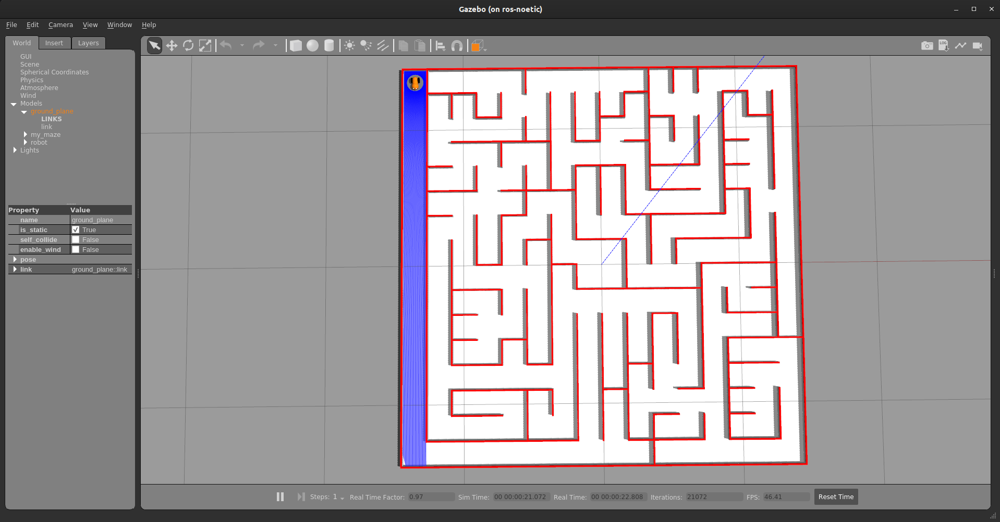

# Installation Guide


1. Download the `micromouse` package => <a href="micromouse.zip" download><button>Download</button></a>


1. Extract files to your `workspace/src` folder.

1. Once the repository is updated build your workspace and source the setup.bash of your workspace.

    ```bash
    cd ~/workspace
    catkin_make
    source devel/setup.bash
    ```

1. To check if everything is installed properly enter the following command:

    ```bash
    roslaunch micromouse micromouse.launch
    ```

    If everything is in place you should see the following environment in Gazebo.

    

---