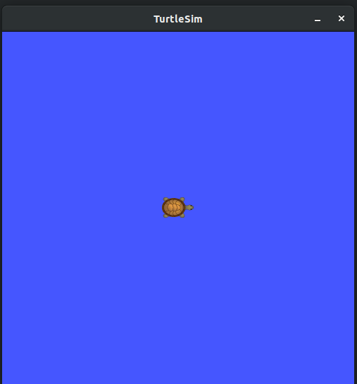
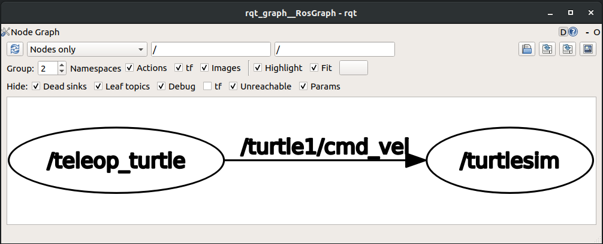
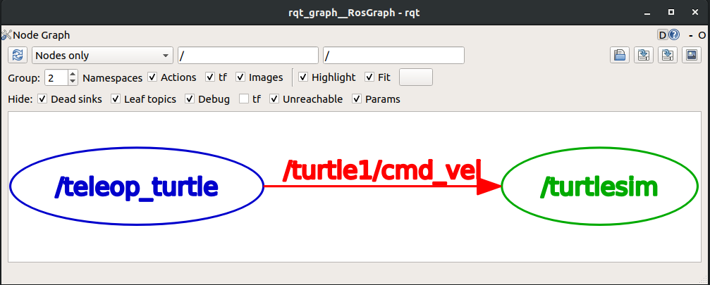

# Rqt_graph

## ROS GUI Development Tool (rqt)

  - ROS provides various GUI tools for robot development.

  - These tools helps to visualize and analyze your ROS Application.

  - Following are some rqt tools provided by ROS.
    - rqt plugins
    - rqt_image_view
    - rqt_graph
    - rqt_plot
    - rqt_bag

  - `rqt_graph` is a tool used to your entire ROS Network as a diagram.

  - This is a very handy tool if you want to visualize how ROS Nodes are communicating with each other and how they are connected to each other.

## Usage

  In this secion, we will see few inspection commands that are used to find information about ROS Nodes and ROS Topics running as a part of a ROS application.

  First and foremost, open a new terminal and type roscore command to start your ROS Master node.
  
  ```bash
  $ roscore
  ```

  Now the result of this command will resemble he output discussed in previous module. For this module we will be using turtlesim simulator that is part of ROS installation.

  Run following command in a new terminal window.

  ```bash
  $ rosrun turtlesim turtlesim_node
  ```

  You will see output similar to this:

  ```bash
  [ INFO] [1601303390.799401514]: Starting turtlesim with node name /turtlesim
  [ INFO] [1601303390.804994858]: Spawning turtle [turtle1] at x=[5.544445], y=[5.544445], theta=[0.000000]
  ```

  You will also see image of a turtle at the center in the display screen, as shown in the output below. The turtle in the window is called as turtle1 because it is the first and only turtle in our display.

  

  So there will be two terminal windows active which can be minimized or dragged off to the side or bottom but should not be closed. We will use three commands that will help us find our way around.

  The first command is, "rosnode list". This command prints a list of all running nodes on the terminal.

  In third terminal, run the following command:

  ```bash
  $ rosnode list
  ```

  You will see output similar to this:

  ```bash
  /rosout
  /turtlesim
  ```

  The next command "rosnode info ". This command prints node specific information on the terminal.

  ```bash
  $ rosnode info /turtlesim
  ```

  You will see output similar to this:

  ```bash
  Node [/turtlesim]
  Publications: 
   * /rosout [rosgraph_msgs/Log]
   * /turtle1/color_sensor [turtlesim/Color]
   * /turtle1/pose [turtlesim/Pose]

  Subscriptions: 
   * /turtle1/cmd_vel [unknown type]

  Services: 
   * /clear
   * /kill
   * /reset
   * /spawn
   * /turtle1/set_pen
   * /turtle1/teleport_absolute
   * /turtle1/teleport_relative
   * /turtlesim/get_loggers
   * /turtlesim/set_logger_level


   contacting node http://ruchi24-Vostro-15-3568:42299/ ...
   Pid: 12698
   Connections:
    * topic: /rosout
       * to: /rosout
       * direction: outbound (57779 - 127.0.0.1:51260) [24]
       * transport: TCPROS
  ```

  And finally, the command "rqt_graph". This command provides a visual representation of the different nodes and the way they interact with each other. We can see the structure of how topics are passed around the system using rqt_graph.

  rqt_graph is part of the rqt package. Unless you already have it installed, run:

  ```bash
  $ sudo apt-get install ros-melodic-rqt
  $ sudo apt-get install ros-melodic-rqt-common-plugins
  ```

  We'll need something to drive the turtle aroud with. Open a new terminal window and run following command:

  ```bash
  $ rosrun turtlesim turtle_teleop_key
  ```

  You will see output similar to this:

  ```bash
  Reading from keyboard
  ---------------------------
  Use arrow keys to move the turtle. 'q' to quit.
  ```

  You can use arrow keys from the keyboard to drive the turtle around. Now that you can drive your turtle around, let's see what's going on behind the scenes.

  Basically the turtlesim_node and turtle_teleop_key are communicating with each other over a ROS Topic. turtle_teleop_key is publishing the key strokes on a topic, while turtlesim subscribes to the same topic to receive the key strokes.

  Open a new terminal window and run following command:

  ```bash
  $ rosrun rqt_graph rqt_graph
  ```

  You will see output similar to this:

  

  If you place your mouse over /turtle1/command_velocity it will highlight the ROS nodes (here blue and green) and topics (here red). As you can see, the turtlesim_node and the turtle_teleop_key nodes are communicating on the topic named /turtle1/command_velocity. 

  

  <hr>

### Reference
  1. [ROS Wiki - rqt_graph](http://wiki.ros.org/ROS/Tutorials/UnderstandingTopics#Using_rqt_graph)