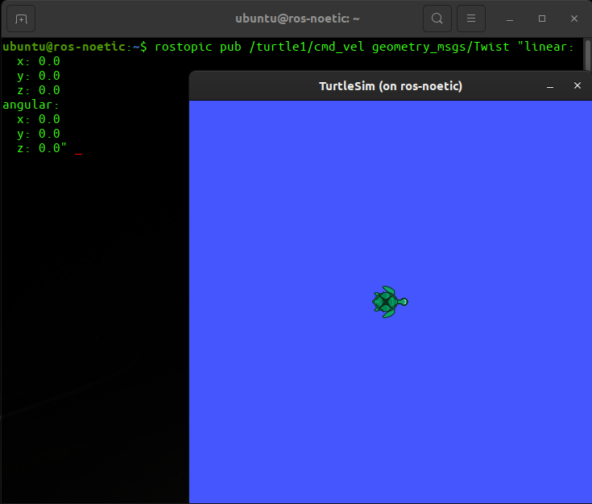
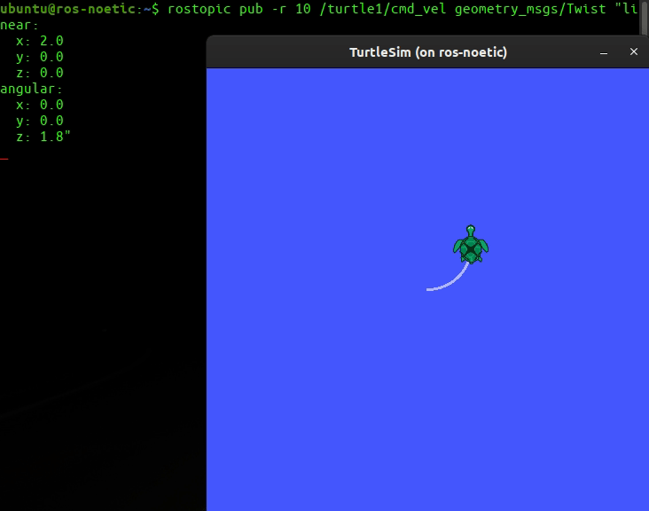

# pub

- `rostopic pub` publishes data on to a topic currently advertised. 

- Usage:
```bash
rostopic pub [topic] [msg_type] [args]
```

- Let's move the turtle inside the turtlsim window.

```bash
rostopic pub /turtle1/cmd_vel geometry_msgs/Twist "linear:
x: 0.0 
y: 0.0
z: 0.0
angular:
x: 0.0
y: 0.0
z: 0.0"
```

> Here we recommend to double tap the TAB button after `/turtle1/cmd_vel` (don't forget the space after the topic name). You'll see the message **type** appearing after a few instance. Similarly, double tapping after 'geometry_msgs/Twist' will make the corresponding message content appear automatically. Try it with other commands too.



- Now that we have the complete blank (with all _constants_ as zeros) pub command for `/turtle1/cmd_vel`, let's rotate it about its z-axis (Yep! the Omega variable).

```bash
rostopic pub /turtle1/cmd_vel geometry_msgs/Twist "linear:
x: 0.0 
y: 0.0
z: 0.0
angular:
x: 0.0
y: 0.0
z: 0.5
```

- After executing the above command you will see the turtle rotating clockwise. 


- However, the turtle only rotated for a while and not continuously. This is because our `pub` command was only sent once. So, to keep the turtle rotating we need to keep sending our `pub` command repeatedly. And to do so, we'll use the `-r` argument with `pub` command.

- The following command is used to publish a steady stream of commands at a rate of 10Hz.

```bash
rostopic pub -r 10 /turtle1/cmd_vel geometry_msgs/Twist "linear:
x: 2.0
y: 0.0
z: 0.0
angular:
x: 0.0
y: 0.0
z: 1.8"
```



- You can always know more about `pub` command by simply typing `rostopic pub --help`.

> For more details refer, [http://wiki.ros.org/rostopic#rostopic_pub](http://wiki.ros.org/rostopic#rostopic_pub)

---