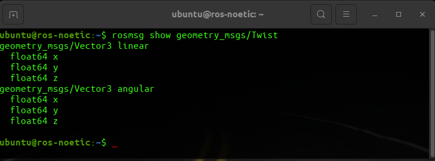

# type, info and rosmsg

## type

Communication on topics happens by sending ROS messages between [nodes](http://wiki.ros.org/Nodes). To communicate, the publisher and subscriber must send and receive the same **type** of message. This means that a topic **type** is defined by the message **type** published on it. The **type** of the message sent on a topic can be determined using `rostopic type`. 

```bash
rostopic type [topic]
```

- From the previous section, we know that the turtlesim node has 3 topics being published/subscribed. 

    - `/turtle1/cmd_vel`
    - `/turtle1/pose`
    - `/turtle1/color_sensor`

- Lets consider the topics `/turtle1/cmd_vel`. Enter the following command to get the message type.

    ```bash
    rostopic type /turtle1/cmd_vel
    ```

    

## rosmsg

- As you can observe the type of message associated with `/turtle1/cmd_vel` is `geometry_msgs/Twist`. let's look into more detail of the message, using `rosmsg show [messageType]` command: 

    ```bash
    rosmsg show geometry_msgs/Twist
    ```
    

- A message consists of two parts, _field and constant_. Simply, **fields** is the datatype and **constants** are the representative value. From the above figure, you can observe that these _field and constants_ are displayed twice. However, both of these sections, are separate since they have a different **header** or different sub-information from the same robot. The 2 **headers** seen are...

    - `geometry_msgs/Vector3 linear:` Describes the linear velocities of all the 3 axes.

    - `geometry_msgs/Vector3 angular:` While this header describes, angular velocities of all 3 axes.

> For more details regarding _messages_ in ROS refer to [wiki.ros.org/msg](http://wiki.ros.org/msg).

> For more information on `geometry_msgs/Twist` refer, this [thread](https://stackoverflow.com/questions/50976281/what-do-x-y-and-z-mean-in-geometry-msgs-twist-message-in-ros) of Stackoverflow forum.

## info

- This command provides a little more detail about topics then `type` argument. 

```bash
rostopic info /turtle1/cmd_vel
```

- The output of this command will yield both

    - the message **type** and
    - the nodes which are publishing it or subscribing it.


---

