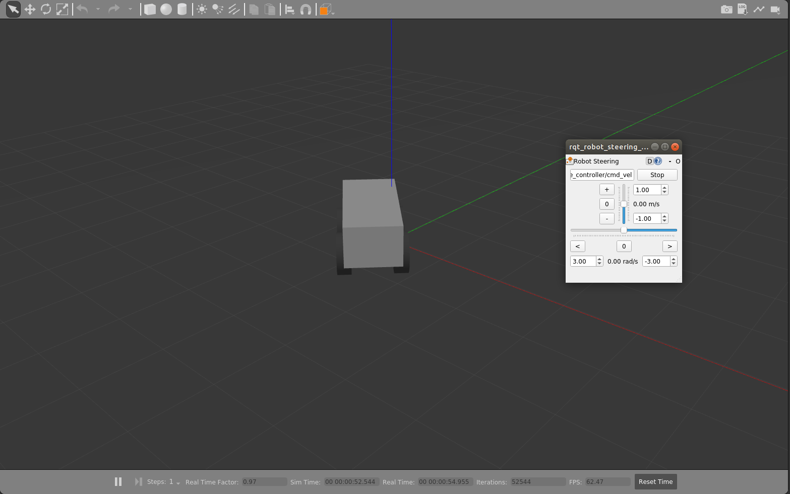

# Using a URDF in Gazebo

In this section we will learn how to spawn and control our robot in Gazebo.

## 1. Nonfunctional Gazebo Interface

We can spawn the model we already created into Gazebo for that lets create a launch file called `gazebo.launch`.

```xml
<launch>

	<!-- these are the arguments you can pass this launch file, for example paused:=true -->
	<arg name="paused" default="false"/>
	<arg name="use_sim_time" default="true"/>
	<arg name="gui" default="true"/>
	<arg name="headless" default="false"/>
	<arg name="debug" default="false"/>
	<arg name="model" default="$(find myrobot_description)/urdf/macroed.urdf.xacro"/>

	<!-- We resume the logic in empty_world.launch, changing only the name of the world to be launched -->
	<include file="$(find gazebo_ros)/launch/empty_world.launch">
		<arg name="debug" value="$(arg debug)" />
		<arg name="gui" value="$(arg gui)" />
		<arg name="paused" value="$(arg paused)"/>
		<arg name="use_sim_time" value="$(arg use_sim_time)"/>
		<arg name="headless" value="$(arg headless)"/>
	</include>

	<param name="robot_description" command="$(find xacro)/xacro $(arg model)" />

	<!-- push robot_description to factory and spawn robot in gazebo -->
	<node name="urdf_spawner" pkg="gazebo_ros" type="spawn_model" args="-z 1.0 -unpause -urdf -model robot -param robot_description" respawn="false" output="screen" />

	<node pkg="robot_state_publisher" type="robot_state_publisher"  name="robot_state_publisher">
		<param name="publish_frequency" type="double" value="30.0" />
	</node>

</launch>
```

This launch file 

  - Loads the urdf from the macro tutorial into the parameter description (as before)
  - Launches an empty gazebo world
  - Runs the script to read the urdf from the parameter and spawn it in gazebo.
  - By default, the gazebo gui will also be displayed.

However, it doesn't do anything, and is missing lots of key information that ROS would need to use this robot. Previously we had been using [joint_state_publisher](http://wiki.ros.org/joint_state_publisher) to specify the pose of each joint. However, the robot itself should provide that information in the real world or in gazebo. Yet without specifying that, Gazebo doesn't know to publish that information.

To get the robot to be interactive (with you and ROS), we need to specify two things: Plugins and Transmissions. 

## 2. Gazebo Plugin

To get ROS to interact with Gazebo, we have to dynamically link to the ROS library that will tell Gazebo what to do. Theoretically, this allows for other Robot Operating Systems to interact with Gazebo in a generic way. In practice, its just ROS.

To link Gazebo and ROS, we specify the plugin in the URDF, right before the closing `</robot>` tag:

```xml
<gazebo>
    <plugin name="gazebo_ros_control" filename="libgazebo_ros_control.so">
        <robotNamespace>/</robotNamespace>
    </plugin>
</gazebo>
```

you can run this by the command:

```bash
roslaunch myrobot_description gazebo.launch
```

However, this won't do anything new yet. For that we need to specify more information outside the URDF.

## 3. Spawning Controllers

Now that we've linked ROS and Gazebo, we need to specify some bits of ROS code that we want to run within Gazebo, which we generically call controllers. These are initially loaded into the ROS parameter space. We will create a yaml file joints.yaml that specifies our first controller.

make a directory named `config` in your package and in it make a file called `joints.yaml` and copy the following in it:

```yaml
type: "joint_state_controller/JointStateController"
publish_rate: 50
```
load this yaml file into the `myrobot_joint_state_controller` namespace add the following in your launch file before the `</launch>` tag:

```xml
<rosparam command="load" file="$(find myrobot_description)/config/joints.yaml" ns="myrobot_joint_state_controller" />

<node name="myrobot_controller_spawner" pkg="controller_manager" type="spawner" args="myrobot_joint_state_controller --shutdown-timeout 3"/>
```

You can launch this, but its still not quite there.
This will run the controller and in fact publish on the /joint_states topic....but with nothing in them.

What else do you want Gazebo!? Well, it wants to know what joints to publish information about.

## 4. Transmissions

For every non-fixed joint, we need to specify a transmission, which tells Gazebo what to do with the joint. Lets specify transmissions to our wheel joints and add the following for each of the wheels from within the wheel macro. :

```xml
<transmission name="${prefix}_${suffix}_wheel_trans">
	<type>transmission_interface/SimpleTransmission</type>
	<actuator name="${prefix}_${suffix}_wheel_motor">
		<mechanicalReduction>1</mechanicalReduction>
	</actuator>
	<joint name="${prefix}_${suffix}_wheel_joint">
		<hardwareInterface>hardware_interface/VelocityJointInterface</hardwareInterface>
	</joint>
</transmission>
```

This is just like the other transmissions, except

  - It uses macro parameters to specify names

  - It uses a VelocityJointInterface.

Since the wheels are actually going to touch the ground and thus interact with it physically, we also specify some additional information about the material of the wheels.

```xml
<gazebo reference="${prefix}_${suffix}_wheel">
    <mu1 value="200.0" />
    <mu2 value="100.0" />
    <kp value="10000000.0" />
    <kd value="1.0" />
    <material>Gazebo/Grey</material>
</gazebo>
```

We could specify controllers for each of the individual wheels, but we want to control all the wheels together. For that, we're going to need a lot of ros parameters.

make another file called `diffdrive.yaml` in your `config` folder and copy the following in it.

```yaml
type: "diff_drive_controller/DiffDriveController"
  publish_rate: 50

  left_wheel: ['left_front_wheel_joint', 'left_back_wheel_joint']
  right_wheel: ['right_front_wheel_joint', 'right_back_wheel_joint']

  wheel_separation: 0.44

  # Odometry covariances for the encoder output of the robot. These values should
  # be tuned to your robot's sample odometry data, but these values are a good place
  # to start
  pose_covariance_diagonal: [0.001, 0.001, 0.001, 0.001, 0.001, 0.03]
  twist_covariance_diagonal: [0.001, 0.001, 0.001, 0.001, 0.001, 0.03]

  # Top level frame (link) of the robot description
  base_frame_id: base_link

  # Velocity and acceleration limits for the robot
  linear:
    x:
      has_velocity_limits    : true
      max_velocity           : 0.2   # m/s
      has_acceleration_limits: true
      max_acceleration       : 0.6   # m/s^2
  angular:
    z:
      has_velocity_limits    : true
      max_velocity           : 2.0   # rad/s
      has_acceleration_limits: true
      max_acceleration       : 6.0   # rad/s^2
```

The DiffDriveController subscribes to a standard Twist cmd_vel message and moves the robot accordingly.

We will have to load this file just like we did with `joints.yaml`.

This is the final macroed version of the urdf file: <a href="ROS_with_Gazebo/Gazebo_Plugins/macroed.urdf.xacro" download><button>Download</button></a>

This is the final version of the launch file: <a href="ROS_with_Gazebo/Gazebo_Plugins/gazebo.launch" download><button>Download</button></a>

```bash
roslaunch myrobot_description gazebo.launch
```

In addition to loading the above configuration, this also opens the RobotSteering panel, allowing you to drive the R2D2 robot around, while also observing its actual behavior (in Gazebo):



Congrats! Now you're simulating robots with URDF.

<hr>