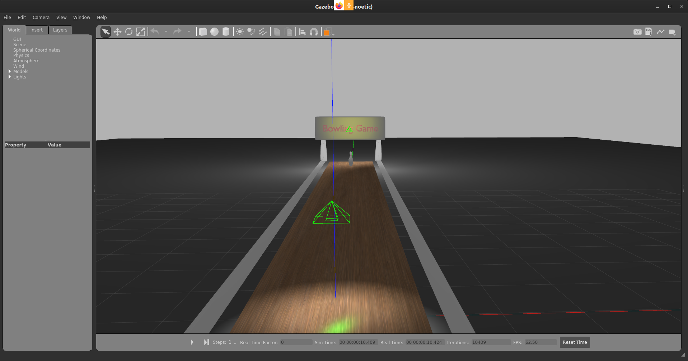
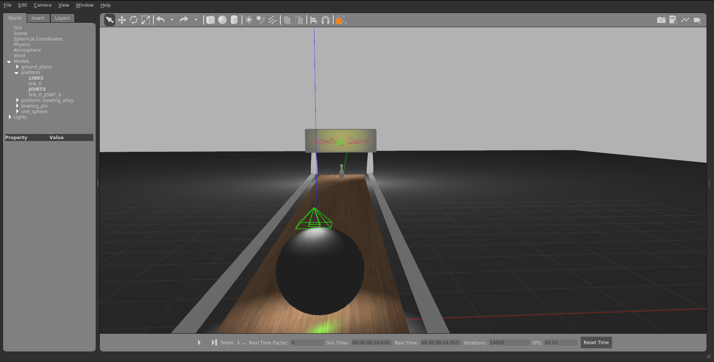
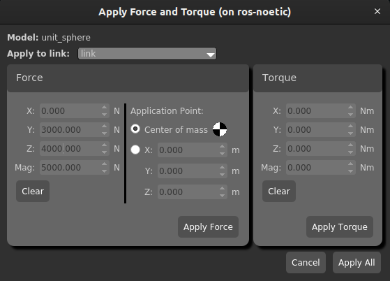

# Example: Knock down the bowling pin

**Goal**: Using a sphere knock down the bowling pin spawned in bowling game.


## 1 Prerequisites

1. A package `ros_gazebo` as per the instructions in [Installation Guide](../installation.html#Installation%20Guide).

1. Add these models and textures to `pkg_gazebo` => <a href="gazebo_resources.zip" download><button>Download Resources</button></a>

<br/>

## Tasks

<br/>

### 2 Create a launch file

- Let's create a launch to load bowling game in gazebo simulator.

`bowling_game_one_pin.launch`
```xml
<launch>
	<arg name="static" default=""/>
        <include 
            file="$(find gazebo_ros)/launch/empty_world.launch">
            <arg name="world_name"  value="$(find pkg_gazebo)/worlds/bowling_game_one$(arg static).world"/>
        </include>
</launch>
```

<br/>

### 3 Launch the bowling game

```bash
roslaunch pkg_gazebo bowling_game_one_pin.launch 
```



<br/>

### Spawn a sphere on the bowling track

- Click on sphere on the top toolbar.
- Click on the bowling alley to spawn sphere there as shown in the image below. 




> **Hint**: You can always move the sphere using the Transition Tool or by selecting the sphere and pressing T.

<br/>

### 4 Knock the bowling pin using sphere

- Click on sphere to select it.
- Right-click on it and select **Apply Force/Torque**.
- Apply a force of `10000 N` in y-direction. Remember this force is applied for _1ms_. So, the impulse is 10 N-s.

    

- Click to Apply Force to start the simulation. (_Don't forget to unpause the simulation._)

> **Note**: If you want to try this again, go to `Edit > Reset World` or press `Ctrl+R`.

<br/>

## Summary

You've learnt how to load a world in gazebo simulator using launch files. Also, you've successfully used gazebo simulator tools to knock down the bowling pin.

---