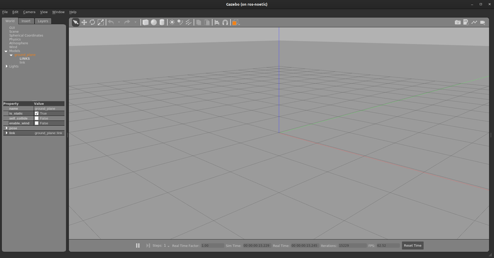

# Gazebo Simulator

Gazebo is a 3D dynamic simulator with the ability to accurately and efficiently simulate populations of robots in complex indoor and outdoor environments. While similar to game engines, Gazebo offers physics simulation at a much higher degree of fidelity, a suite of sensors, and interfaces for both users and programs.

## Features

-   multiple physics engines,

-   a rich library of robot models and environments,

-   a wide variety of sensors,

-   convenient programmatic and graphical interfaces

## Understanding the GUI

To get a brief overview of the GUI of gazebo, open this [link](http://gazebosim.org/tutorials?cat=guided_b&tut=guided_b2).

## Adding models to Simulator

1. Let's first open a gazebo simulator environment.

    ```bash
    roslaunch gazebo_ros empty_world.launch 
    ```

    

1. You can add primitive shapes like cube, sphere and sphere from upper toolbar.

    

1. You can also add some other models by going to `Insert` on the left panel. Let's try adding `Ambulance` to the scene which is under `http://models.gazebosim.org/`. _It can take some time to download and load._

    

1. You can also add some other custom models saved on you hard disk by adding path.


## Applying force/torque to a model

First, select sphere. Right-click on it and select apply force/torque. Fill in the details as shown below.

<center>


</center>

> **Note**: Don't forget to click on play button to start the simulation.

Now click on apply force. You can see the force being applied. Notice that the force is applied for **1ms**, so we've provided such high force for such a small ball to increase the impulse.

---