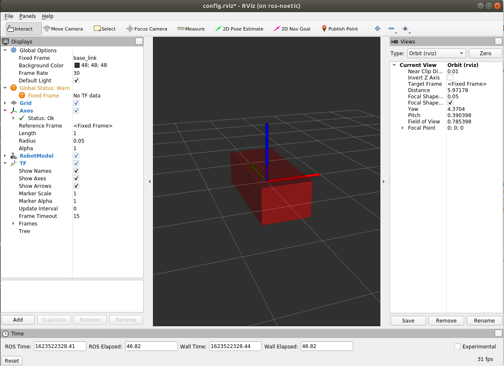
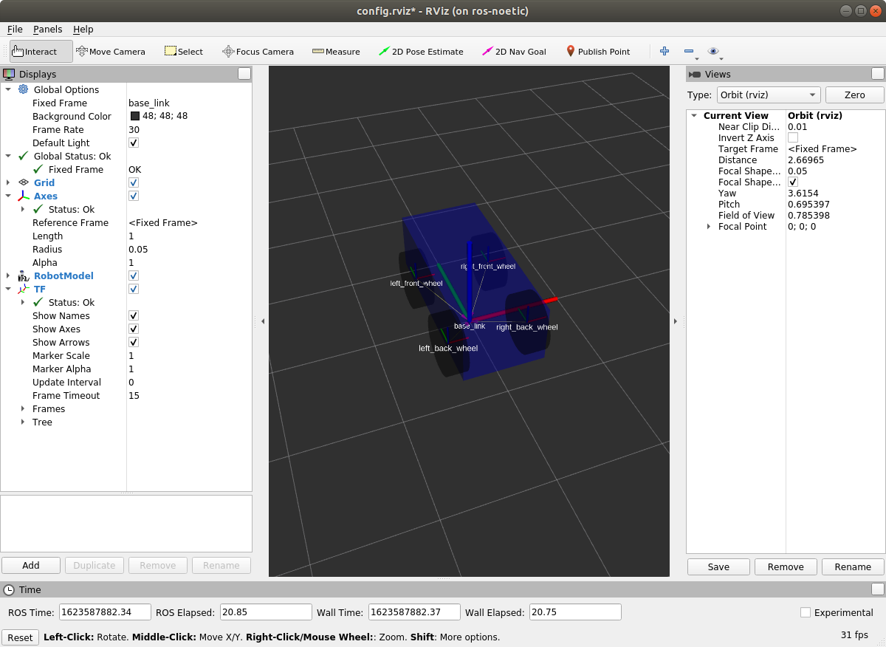

# Building A visula robot model with URDF

In this tutorial, we’re going to build a visual model of a robot that vaguely looks like a car. In later tutorials we will learn how to add physical properties to our model, generate neater code with xacro and make it move in Gazebo. But for now, we’re going to focus on getting the visual geometry correct.

## Getting Started

Lets make a package called myrobot_description which will depend on URDF. Go to your workspace `src` folder and run.

```bash
cd workspace/src
catkin_create_pkg myrobot_description urdf
```

After that make a directory called `urdf` and in it create a file called `myrobot.urdf`. Now we are ready to make our robot.

## 1. One Simple Shape

  First, we’re just going to explore one simple shape. Here’s about as simple as a urdf as you can make. Open the `myrobot.urdf` file in your text editor and copy paste the following:

```xml
<?xml version="1.0"?>

<robot name="myrobot">
	  <link name="base_link">
      <visual>
          <geometry>
              <box size="0.8 1.8 0.6"/>
          </geometry>
       </visual>
  </link>
</robot>
```

  To translate the XML into English, this is a robot with the name myfirst, that contains only one link (a.k.a. part), whose visual component is just a box 0.8 meters wide, 1.8 meters long and 0.6 meter height.

  To examine the model in rviz we need to do the following:

  1. Create a `launch` directory in your package and create a file called `display.launch` and paste the following in it:

```xml
<launch>
	<!-- arguments that can be given during executing the launch file -->
	<!-- stores the path to your urdf file in model argument -->
	<arg name="model" default="$(find myrobot_description)/urdf/myrobot.urdf"/>
	<arg name="gui" default="true" />
	<!-- stores the path to your rviz configuration file -->
	<arg name="rvizconfig" default="$(find myrobot_description)/rviz/config.rviz" />

	<!-- This parameter loads the urdf file we have created -->
	<param name="robot_description" command="$(find xacro)/xacro $(arg model)" />

	<!-- this simply loads the joint state publisher to know more about that vist: (http://wiki.ros.org/joint_state_publisher) -->
	<node if="$(arg gui)" name="joint_state_publisher" pkg="joint_state_publisher_gui" type="joint_state_publisher_gui" />
	<node unless="$(arg gui)" name="joint_state_publisher" pkg="joint_state_publisher" type="joint_state_publisher" />
	<node name="robot_state_publisher" pkg="robot_state_publisher" type="robot_state_publisher" />
	<node name="rviz" pkg="rviz" type="rviz" args="-d $(arg rvizconfig)" required="true" />

</launch>
```

  2. As you can see in the above code we are also loading a file called `config.rviz` which is a configuration file for rviz so lets just do that. Make a directory called `rviz` in your package and copy the following file in it.

  <center>config.rviz</center>
  <center><a href="./config.rviz" download><button>Download</button></a></center>

  3. Now run build your package and run the launch file.

```bash
cd workspace
catkin_make
roslaunch myrobot_description display.launch
```
  
  You should be able to see the following:


## 2. Multiple Shapes

  Now let’s look at how to add multiple shapes/links. If we just add more link elements to the urdf, the parser won’t know where to put them. So, we have to add joints. Joint elements can refer to both flexible and inflexible joints. We’ll start with inflexible, or fixed joints.

```xml
<link name="right_front_wheel">
    <visual>
        <geometry>
            <cylinder length="0.2" radius="0.3"/>
        </geometry>
    </visual>
</link>
<joint name="right_front_wheel_joint" type="fixed">
    <parent link="base_link"/>
    <child link="right_front_wheel"/>
</joint>
```

  - note how we have defined a cylinder with length 0.2 and radius 0.3

  - The joint is defined in terms of a parent and a child. URDF is ultimately a tree structure with one root link. This means that the wheel’s position is dependent on the base_link’s position.

## 3. Origins

  we need to specify the position of the wheels and also the orientation for that we will use the origin tag:

```bash
<link name="right_front_wheel">
    <visual>
        <origin rpy="0 1.57075 0" xyz="0 0 0"/>
        <geometry>
            <cylinder length="0.2" radius="0.3"/>
        </geometry>
    </visual>
</link>
<joint name="right_front_wheel_joint" type="fixed">
    <axis rpy="0 0 0" xyz="1 0 0"/>
    <parent link="base_link"/>
    <child link="right_front_wheel"/>
    <origin rpy="0 0 0" xyz="0.4 0.5 0.3"/>
</joint>
```

  - This will rotate the cylinder and fix its position on the base_link.

## 4. Adding Material And Finishing The Model

  The material tag allows us to define the color of our links. Ex:

```xml
<material name="blue">
    <color rgba="0 0 0.8 1"/>
</material>
```
  
  Now lets finish the model with all four wheels and their materials. The complete urdf file should look like this:

```xml
<?xml version="1.0"?>

<robot name="myrobot">
    
    <material name="blue">
        <color rgba="0 0 0.8 1"/>
    </material>
    <material name="white">
        <color rgba="1 1 1 1"/>
    </material>
    <material name="black">
        <color rgba="0 0 0 1"/>
    </material>


    <link name="base_link">
        <visual>
            <origin rpy="0 0 0" xyz="0 0 0.5"/>
            <geometry>
                <box size="0.8 1.8 0.6"/>
            </geometry>
            <material name="blue"/>
        </visual>
    </link>

    <link name="right_front_wheel">
        <visual>
            <origin rpy="0 1.57075 0" xyz="0 0 0"/>
            <geometry>
                <cylinder length="0.2" radius="0.3"/>
            </geometry>
            <material name="black"/>
        </visual>
    </link>
    <joint name="right_front_wheel_joint" type="fixed">
        <parent link="base_link"/>
        <child link="right_front_wheel"/>
        <origin rpy="0 0 0" xyz="0.4 0.5 0.3"/>
    </joint>

    <link name="left_front_wheel">
        <visual>
            <origin rpy="0 1.57075 0" xyz="0 0 0"/>
            <geometry>
                <cylinder length="0.2" radius="0.3"/>
            </geometry>
            <material name="black"/>
        </visual>
    </link>
    <joint name="left_front_wheel_joint" type="fixed">
        <parent link="base_link"/>
        <child link="left_front_wheel"/>
        <origin rpy="0 0 0" xyz="-0.4 0.5 0.3"/>
    </joint>

    <link name="right_back_wheel">
        <visual>
            <origin rpy="0 1.57075 0" xyz="0 0 0"/>
            <geometry>
                <cylinder length="0.2" radius="0.3"/>
            </geometry>
            <material name="black"/>
        </visual>
    </link>
    <joint name="right_back_wheel_joint" type="fixed">
        <parent link="base_link"/>
        <child link="right_back_wheel"/>
        <origin rpy="0 0 0" xyz="0.4 -0.5 0.3"/>
    </joint>

    <link name="left_back_wheel">
        <visual>
            <origin rpy="0 1.57075 0" xyz="0 0 0"/>
            <geometry>
                <cylinder length="0.2" radius="0.3"/>
            </geometry>
            <material name="black"/>
        </visual>
    </link>
    <joint name="left_back_wheel_joint" type="fixed">
        <parent link="base_link"/>
        <child link="left_back_wheel"/>
        <origin rpy="0 0 0" xyz="-0.4 -0.5 0.3"/>
    </joint>
</robot>

```
  
  now lets see our robot.

```bash
roslaunch urdf_tutorial display.launch
```

  

<hr>
