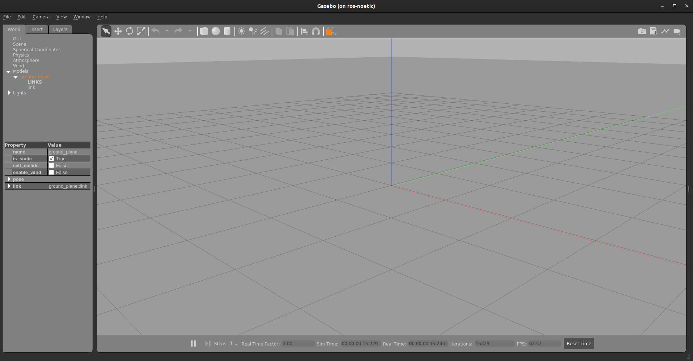

# Installation Guide

1. Make sure you have the gazebo and RViz installed with ros-noetic. Run `roscore` in a separate terminal. Then,

    Run this command to load RViz:

    ```bash
    rosrun rviz rviz
    ```

    Run this command to load the gazebo simulator:

    ```bash
    rosrun gazebo_ros gazebo
    ```

    If RViz and the Gazebo simulator are successfully installed, you'll see the following result:

    `RViz`

    

    `Gazebo Simulator`

    

    > **Note**: You can install any ROS package by running this command in terminal: `sudo apt install ros-noetic-<package-name>`.

1. Let's create another ROS package where we'll keep all the gazebo tutorials related files.

    - Go to the `src` folder of `workspace` where ROS packages are located.
        ```bash
        cd ~/workspace/src
        ```

    - Create a ROS package with following dependencies.
        ```bash
        catkin_create_pkg pkg_gazebo roscpp geometry_msgs std_msgs gazebo_ros gazebo_dev tf tf2 dynamic_reconfigure rviz
        ```

    - Create directories where we'll save worlds.

        ```bash
        cd pkg_gazebo
        mkdir config scripts worlds lib models launch
        ```

1. Open `package.xml`, and make sure these two lines are in between `export` tag and uncommented.
    ```xml
    <export>
        <gazebo_ros gazebo_model_path="${prefix}/models"/>
        <gazebo_ros gazebo_media_path="${prefix}/models"/>
        <gazebo_ros plugin_path="$(prefix)/lib"/>
    </export>
    ```

    You also have to add `message_runtime` and `message_generation`. Now, your `package.xml` file should look something like this:

    `package.xml`

    ```xml
    <?xml version="1.0"?>
    <package format="2">
        <name>pkg_gazebo</name>
        <version>0.0.0</version>
        <description>The pkg_gazebo package</description>

        <maintainer email="ubuntu@todo.todo">ubuntu</maintainer>
        <license>TODO</license>

        <buildtool_depend>catkin</buildtool_depend>
        <build_depend>dynamic_reconfigure</build_depend>
        <build_depend>gazebo_dev</build_depend>
        <build_depend>gazebo_ros</build_depend>
        <build_depend>geometry_msgs</build_depend>
        <build_depend>roscpp</build_depend>
        <build_depend>rviz</build_depend>
        <build_depend>std_msgs</build_depend>
        <build_depend>tf</build_depend>
        <build_depend>tf2</build_depend>
        <build_depend>message_generation</build_depend>

        <build_export_depend>dynamic_reconfigure</build_export_depend>
        <build_export_depend>gazebo_dev</build_export_depend>
        <build_export_depend>gazebo_ros</build_export_depend>
        <build_export_depend>geometry_msgs</build_export_depend>
        <build_export_depend>roscpp</build_export_depend>
        <build_export_depend>rviz</build_export_depend>
        <build_export_depend>std_msgs</build_export_depend>
        <build_export_depend>tf</build_export_depend>
        <build_export_depend>tf2</build_export_depend>

        <exec_depend>dynamic_reconfigure</exec_depend>
        <exec_depend>gazebo_dev</exec_depend>
        <exec_depend>gazebo_ros</exec_depend>
        <exec_depend>geometry_msgs</exec_depend>
        <exec_depend>roscpp</exec_depend>
        <exec_depend>rviz</exec_depend>
        <exec_depend>std_msgs</exec_depend>
        <exec_depend>tf</exec_depend>
        <exec_depend>tf2</exec_depend>
        <exec_depend>message_runtime</exec_depend>


        <!-- The export tag contains other, unspecified, tags -->
        <export>
            <!-- Other tools can request additional information be placed here -->
            <gazebo_ros gazebo_model_path="${prefix}/models"/>
            <gazebo_ros gazebo_media_path="${prefix}/models"/>
            <gazebo_ros plugin_path="$(prefix)/lib"/>

        </export>
    </package>
    ```

    <center><a href="package.xml" download><button>Download</button></a></center>

    `CMakeLists.txt`

    ```txt
    cmake_minimum_required(VERSION 3.0.2)
    project(pkg_gazebo)

    add_compile_options(-std=c++11)

    find_package(catkin REQUIRED COMPONENTS
    message_generation
    gazebo_msgs
    nav_msgs
    std_srvs
    dynamic_reconfigure
    gazebo_dev
    gazebo_ros
    geometry_msgs
    roscpp
    rviz
    std_msgs
    tf
    tf2
    tf2_ros
    )

    find_package(gazebo REQUIRED)
    include_directories(include ${GAZEBO_INCLUDE_DIRS})

    find_package(Boost REQUIRED COMPONENTS thread)
    include_directories(${Boost_INCLUDE_DIRS})

    ################################################
    ## Declare ROS messages, services and actions ##
    ################################################

    ## Generate messages in the 'msg' folder
    # add_message_files(
    #   FILES
    #   Message1.msg
    #   Message2.msg
    # )

    ## Generate services in the 'srv' folder
    # add_service_files(
    #   FILES
    #   Service1.srv
    #   Service2.srv
    # )

    ## Generate actions in the 'action' folder
    # add_action_files(
    #   FILES
    #   Action1.action
    #   Action2.action
    # )

    ## Generate added messages and services with any dependencies listed here
    # generate_messages(
    #   DEPENDENCIES
    #   geometry_msgs#   std_msgs
    # )

    ################################################
    ## Declare ROS dynamic reconfigure parameters ##
    ################################################

    ## Generate dynamic reconfigure parameters in the 'cfg' folder
    # generate_dynamic_reconfigure_options(
    #   cfg/DynReconf1.cfg
    #   cfg/DynReconf2.cfg
    # )

    ###################################
    ## catkin specific configuration ##
    ###################################

    catkin_package(
    INCLUDE_DIRS include
    LIBRARIES pkg_gazebo
    CATKIN_DEPENDS dynamic_reconfigure gazebo_dev gazebo_ros geometry_msgs roscpp rviz std_msgs tf tf2
    DEPENDS system_lib
    )

    ###########
    ## Build ##
    ###########

    include_directories(
    # include
    ${catkin_INCLUDE_DIRS}
    )

    ## Declare a C++ library
    # add_library(${PROJECT_NAME}
    #   src/${PROJECT_NAME}/pkg_gazebo.cpp
    # )

    #############
    ## Install ##
    #############

    #############
    ## Testing ##
    #############
    ```

    <center><a href="CMakeLists.txt" download><button>Download</button></a></center>

1. Let's build the package now.

    ```bash
    cd ~/workspace
    catkin_make
    ```

> **Hint**: Run this command to see if you've successfully build the package. `rospack find <package-name>`. To get more help about how to create a package look into this section: [Create a ROS package](../ROS_Basics_with_Turtlesim/ROS_Package/create_a_ros_package.html#create-a-ros-package).

---