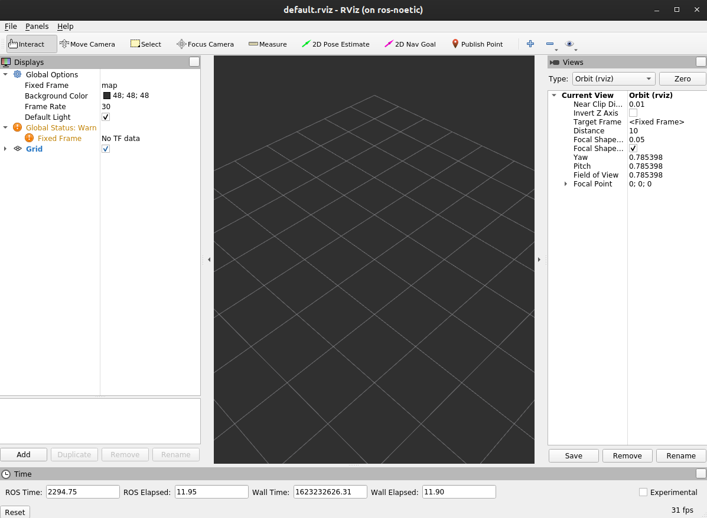

# RViz

<br/>

- RViz is short for `ROS Visualization`.

- It is a 3D visualization software tool for robots, sensors, and algorithms.

-  It enables you to see the robot’s perception of its world (real or simulated).

- The purpose of rviz is to enable you to visualize the state of a robot. It uses sensor data to try to create an accurate depiction of what is going on in the robot’s environment.

<br/>

To launch rviz, type the following command in your terminal:

```bash
roscore
```

And in a different terminal tab, type:

```bash
rosrun rviz rviz
```

Here is the screen you should see when you launch rviz:



The left panel is the Displays panel. It has a list of plugins. These plugins enable you to view sensor data and robot state information. To add a plugin, you would click the Add button on the bottom left of the window.

## Difference between RViz and Gazebo

The difference between the two can be summed up in the following excerpt from Morgan Quigley (one of the original developers of ROS) in his book _Programming Robots with ROS_:

“rviz shows you what the robot thinks is happening, while Gazebo shows you what is really happening.”

- `gazebo` shows the simulated environment in which a robot is placed.

- `rviz` shows the same environment through the eyes of a robot with the help of sensors.

<br/>

> **Note**: To get more familiar with the RViz tool, check out the tutorial videos in this [link](http://wiki.ros.org/rviz/Tutorials).

---