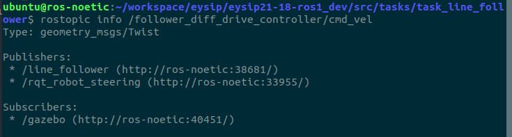

# Design a script to follow the yellow lines

- The objective is to design a script to follow yellow line strips in ht gazebo world.

- For the yellow lines you can simply use the following sdf file `yellow_line.world`.
<center><a href="./yellow_line.world" download><button>Download</button></a></center>

- Create a `world` directory in your package and move the above file in it.

- To load the world file add the following in your launch file.
```xml
<include file="$(find gazebo_ros)/launch/empty_world.launch">
    <arg name="world_name" value="$(find line_follower)/world/yellow_line.world"/>
</include>
```

## Making the script

For making the line follower script you can download the boiler script below and move it in your `scripts` directory of your package.
<center><a href="./line_follower.py" download><button>Download</button></a></center>

you will publish velocities using the topic `/follower_diff_drive_controller/cmd_vel`. You can change the topic name accordingly to your model's diff-drive controller name.

use `rostopic info` command to know more about the rosmsg used for communication



<hr>