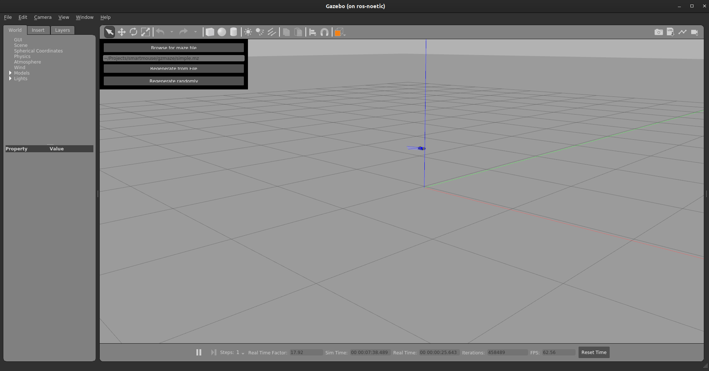
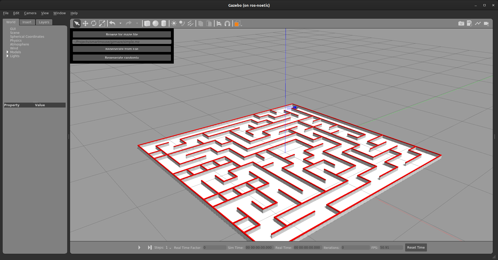

# Add more Mazes

- For adding mazes in gazebo `gzmaze` package is used.

- Instructions to use this package can be on their github repository.

## Github Repository

[https://github.com/PeterMitrano/gzmaze](https://github.com/PeterMitrano/gzmaze)

## Steps to create a new maze

1. Clone the `gzmaze` package in your `workspace/src` directory.

    ```bash
    cd ~/workspace/src
    git clone https://github.com/PeterMitrano/gzmaze.git
    ```

1. Navigate to `gzmaze` directory.

    ```bash
    cd ~/workspace/src/gzmaze
    ```

1. Build the package.

    ```bash
    mkdir build
    cd build
    cmake .. && make
    ```

1. Running `gzmaze`.

    - Make sure to add the following to your `.gazebo/gui.ini` file.

        ```txt
            [overlay_plugins]
            filenames=libregenerate_widget.so
        ```

    - Setup the environment variables you need and run gazebo.

        ```bash
        cd ~/workspace/src/gzmaze
        source setup.sh
        gazebo --verbose gzmaze.world
        ```

1. You will see a window like this. Click on **Regenerate Randomly**. This will create a random maze.

    

1. Now, reset the simulation time and save this maze into a world. `File > Save World as` and type the filename.

    

---