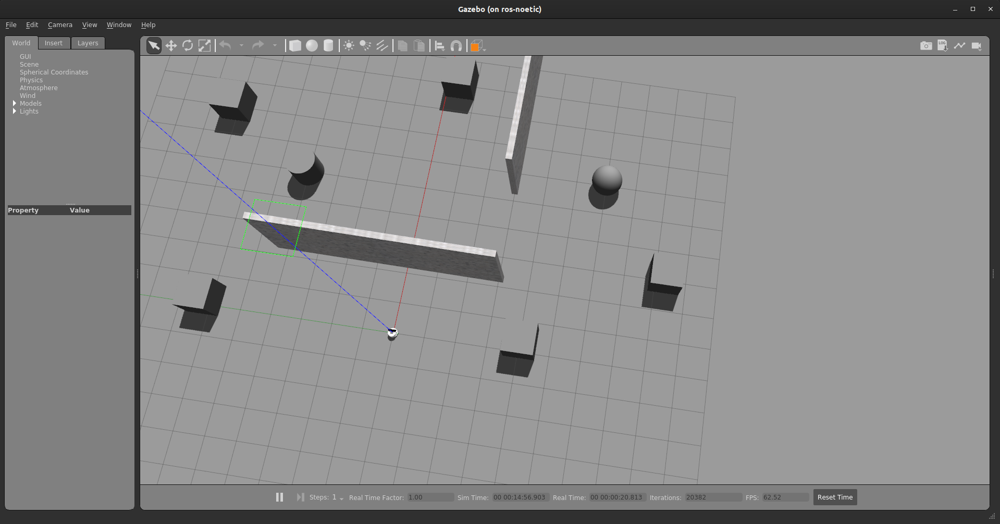

# Installation Guide

- Download Simbhabot simulation packages

    - For this task you would have to update the simulation packages.

    - Download the resources from this link => <a href="simbha_bot_resources.zip" download><button>Download</button></a>

    - Unzip and move these folders to `src` directory of your `workspace`.

    - Once the repository is downloaded build your workspace and source the `setup.bash` of your workspace.

    - To check if everything is installed properly enter the following command.

        ```bash
        roslaunch pkg_simbha_bot simbha_task.launch
        ```

    If everything is in place you should see the following environment in Gazebo.

    

> **Note**: Do not edit any files in these packages. If there is any bug in the packages we will notify you.

---
