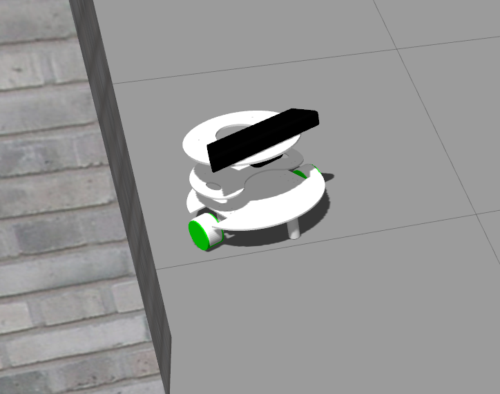

# Problem Statement

- **Objective** - The objective of this task is to navigate a robot in an environment while avoiding collisions.

- Robot has to reach the coordinates `x=7.0` and `y=0.0` while avoiding collisions.

- Some objects will be randomly spawned around the simbhabot during the run.



- **Collision Avoidance**

    - Collision avoidance can be done by using laser scan data.

    - The run will be considered invalid if there is any collision with the walls or objects.


- **Odom**

    - Odometry is to be used by the robot to estimate its position and orientation relative to a starting location.

    - Odometry values will be published on `/odom`.

- **Laser Scan**

    - The laser scan can be used to detect walls or obstacles around the robot.

    - Laser values will be published on `/scan`.

- **Depth Camera**
    - There is a depth camera attached to the simbhabot.
    
    - It provides raw image data on a rostopic.

    - It also provides depth sensibility from an image which can be used to avoid obstacles.

- **depthimage_to_laserscan**

    - `depthimage_to_laserscan` takes a depth image (float encoded meters or preferably uint16 encoded millimeters for OpenNI devices) and generates a 2D laser scan based on the provided parameters. `depthimage_to_laserscan` uses lazy subscribing and will not subscribe to `image` or `camera_info` until there is a subscriber for `scan`.

    - To use this in your implementation of this task, add this to your launch file.

        ```xml
        <include file = "$(find pkg_simbha_bot)/launch/depthimage_to_laserscan.launch" />
        ```

- **Octomap**

    - The **OctoMap** library implements a 3D occupancy grid mapping approach, providing data structures and mapping algorithms in C++.

    - This can be used to build the map of the environment from the depth camera.

    - To use this in your implementation of this task, add this to your launch file.

        ```xml
        <include file = "$(find pkg_simbha_bot)/launch/octomap.launch" />
        ```

- **Simulation Time**

    - In this task simulation time will be considered for grading.


## Procedure

- Use `pkg_simbha_bot` package which was provided to you in [installation guide](installation.html).

- teams can have any number of nodes (Python Scripts **only**) in order to solve this task.

- Create a launch file `simbha_solution.launch` which should launch the gazebo environment and all the nodes necessary to solve the problem statement. We’ll use this launch file to check your solution.

- In this launch file you need to include the following in order to spawn all the necessary models and nodes for simulation.

    ```xml
    <include file = "$(find pkg_simbha_bot)/launch/simbha_task.launch" />
    ```

- You can also launch the RViz directly from launch file.

    ```xml
    <include file = "$(find pkg_simbha_bot)/launch/rviz.launch" />
    ```

- The team would also have to create a `bag_files` folder in `pkg_simbha_bot` package for storing the bag file.

- Instructions to record bag file is given in [Recording logs](recording_logs.html).

<br/>

## Hint

You can any of the technique in order to solve this task.

---
