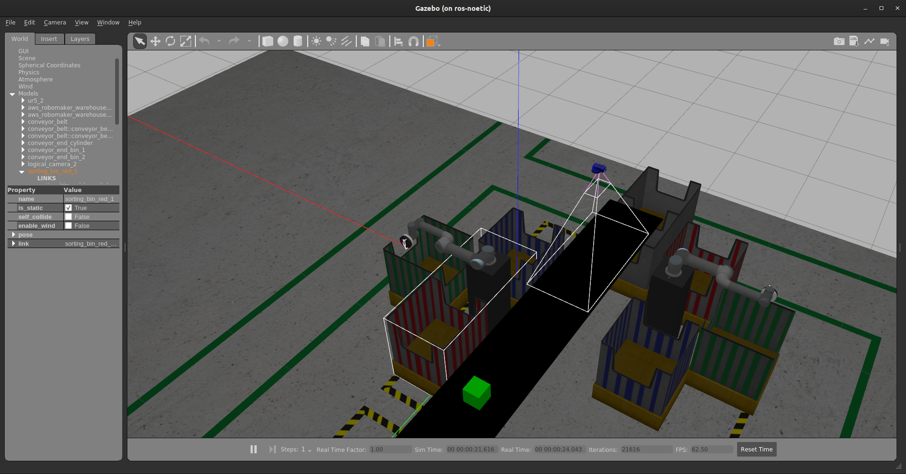

# Problem Statement

- **Objective** - The objective of this task is to sort the packages as quickly as possible using the two UR5 Arms (UR5#1 and UR5#2).

    

- **Sorting**

    - The UR5 (UR5#1 and UR5#2) needs to pick the packages from the conveyor belt and place it the green bins on either side of conveyor belt.

- **Collision Avoidance**

    - While sorting the packages the team needs to make sure that the UR5 (UR5#1 and UR5#2) are not colliding with the conveyor belt, packages on conveyor belt, the bins or with itself.

    - Once a package is picked, the team needs to make sure the package is also not colliding with anything.

    - You can add scene objects directly from launch file to RViz to avoid collision.

- **Logical Camera and Conveyor Belt**

    - The team needs to use the feed from Logical Camera in this task to detect packages.

    - The team would also have to control the conveyor belt in order to make the packages reach the UR5 (UR5#1 and UR5#2).

- **TF**

    - In this task do not rely on TF values as they can fluctuate since we are using two UR5 arms. We would suggest the teams to use `Logical Camera#2` feed to manually calculate the translations. 

- **Simulation Time**

    - In this task simulation time will be considered for grading. So, the teams must make sure to keep the simulation time as low as possible by quickly sorting the packages.

    - **Strategies to decrease Simulation Time**

        - The team can make use of both arms to quickly sort packages.
        - The team can operate the conveyor belt at maximum speed so that packages reach the UR5 faster.
        - The team can make the UR5 pick the packages from a moving conveyor belt.
        - Or any other such strategies.


- **ROS Packages required:**

    1. `pkg_moveit_ur5_1`: The team will have to generate this package using MoveIt! Setup Assistant which will configure MoveIt! for the UR5#1. For this use `ur5_1.urdf` in `pkg_vb_sim/urdf`.

        > **NOTE**: This package is also available in Vargi Bots Simulation Packages as `pkg_moveit_ur5_1_config` with default configuration. You may refer that package to generate this package if you want to configure this your own way or you are free to use this package also.

    1. `pkg_moveit_ur5_2`: The team will have to generate this package using MoveIt! Setup Assistant which will configure MoveIt! for the UR5#2. For this use `ur5_2.urdf` in `pkg_vb_sim/urdf`.

        > **NOTE**: This package is also available in Vargi Bots Simulation Packages as `pkg_moveit_ur5_2_config` with default configuration. You may refer that package to generate this package if you want to configure this your own way or you are free to use this package also.

    1. `pkg_vb_solution`: This is the ROS package in which the team is supposed to implement this task.

    1. `Vargi Bots Simulation Packages`: These packages will have the simulation environment needed for this task.


## pkg_vb_solution

- In this task, teams are allowed to have their own structure for this package. This means that teams can have any number of nodes (Python Scripts **only**), message files, service files, action files, config files etc. in order to solve the task.

### `task_sort.launch`

- It is compulsory for the teams to have a launch file called `task_sort.launch` that will launch the simulation environment and all the necessary nodes that are required to solve this task. While evaluating we are going to use this launch file to run your implementation so make sure that this launch file is proper.

- In this launch file you need to include the following in order to spawn all the necessary models and nodes for simulation.

    ```xml
    <!-- Launch Simulation environment in Gazebo -->
    <include file="$(find pkg_vb_task)/launch/task_multiple_ur5.launch"/>
    ```

- You will also launch `two_ur5_move_group.launch` if you decide to use `pkg_moveit_ur5_1_config` and `pkg_moveit_ur5_2_config` instead of your own MoveIt! Configuration Packages for both the UR5 arms.

    ```xml
    <!-- Launch the two ur5 arms with MoveIt! in RViz -->
    <include file="$(find pkg_vb_sim)/launch/two_ur5_move_group.launch" />
    ```

- If you are using your own `pkg_moveit_ur5_1` and `pkg_moveit_ur5_2` packages then you would have to include your own version of `two_ur5_move_group.launch`.

- Properly comment this launch file. You need to add detailed description of all the nodes that you are going to include in this file as comments. For example,

    ```xml
    <!-- This node is for .....  -->
    <!-- It is also .....  -->
    <node name= "node_sort" pkg= "pkg_vb_solution" type="node_packages_sort.py" output="screen"/>
    ```

### `bag_files` folder

- The team would have to create this folder in `pkg_vb_solution` for storing the bag file.

- Instructions to record bag file is given in [Recording Logs](recording_logs.html).

---