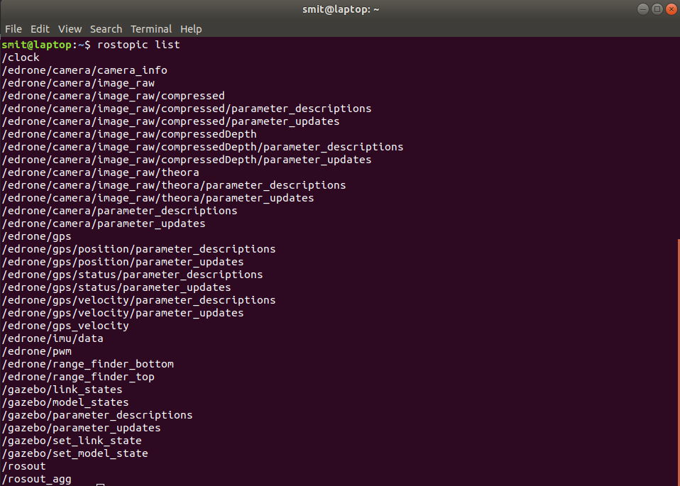

# Installation

## Git

- The first step is to install git. If you have not installed it already then install by executing the following command in a terminal

  ```bash
  sudo apt install git
  ```

## vitarana_drone ROS package

- Next, clone the `vitarana_drone` package from github in your `workspace/src` folder, to do that, execute the following commands

  ```bash
  cd ~/catkin_ws/src
  git clone https://github.com/smitkesaria/vitarana_drone.git
  ```

- Now build the package that you have cloned by executing the following command

  ```bash
  cd ..
  catkin build
  ```

- If the build was successful without any errors you will get a message 100% built .

- Next step is to source `setup.bash` present in the `workspace/devel` so that the terminal shell recognises the ROS package that you just built

  ```bash
  source ~/workspace/devel/setup.bash
  ```

- Alternatively if you have already copied the above command in your `~/.bashrc` then you can also source the `~/.bashrc` and do not need to write the above command always

  ```bash
  source ~/.bashrc
  ```

- Now launch the gazebo world containing the eDrone model

  ```bash
  roslaunch vitarana_drone drone.launch
  ```

  This will open gazebo window and voila, you will be able to see the eDrone model.

  If you follow everything correctly, you will be able to see the world just like shown in the figure below

  

- Open another terminal window and execute the following command to get info of the topics being published/subscribed currently

  ```bash
  rostopic list
  ```

  

## pid_tune GUI ROS package

- This ROS package will help you to tune Proportional Integrate Derivative (PID) control gains throughout Task 1A and 1B.

- Clone the `pid_tune` ROS package from github in your `workspace/src` folder

  ```bash
  cd ~/catkin_ws/src
  git clone https://github.com/simmubhangu/pid_tune.git
  ```

- Now build the package

  ```bash
  cd ..
  catkin build
  ```

- Do not forget to source `~/workspace/devel/setup.bash` or `~/.bashrc` after a successful build

  ```bash
  source ~/workspace/devel/setup.bash

  ```

- To run the pid_tune_drone rosnode, type

  ```bash
  rosrun pid_tune pid_tune_drone.py
  ```

  This will start 4 GUI windows with sliders for Kp, Ki and Kd each for Roll, Pitch, Yaw and Throttle.

  **NOTE**: A *rosnode* can only run when there is *rosmaster* running in background, if not started already then start *rosmaster* using

  ```bash
  roscore
  ```

<hr>