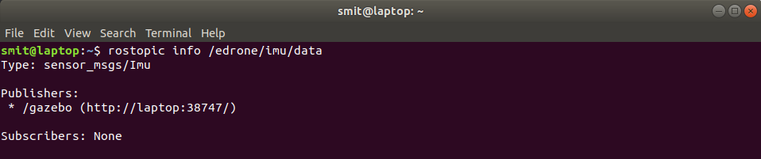
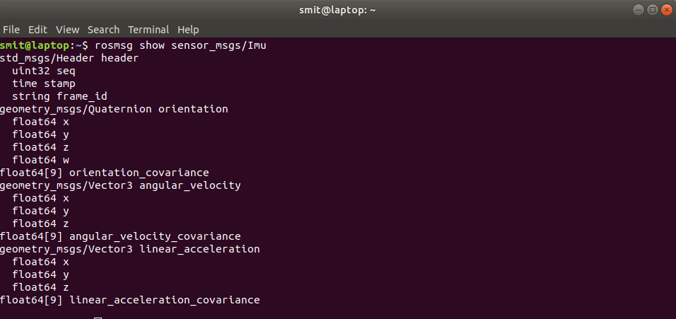
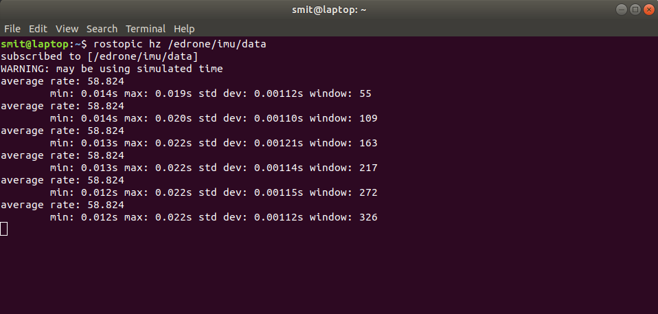
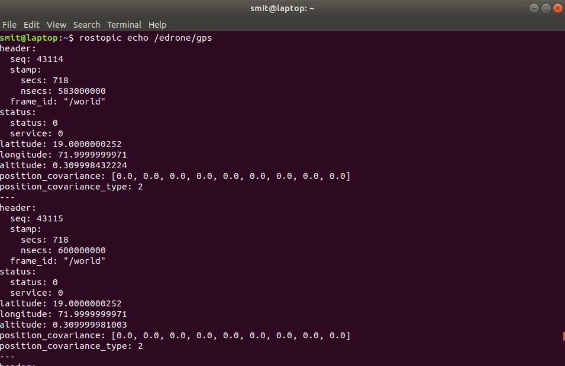
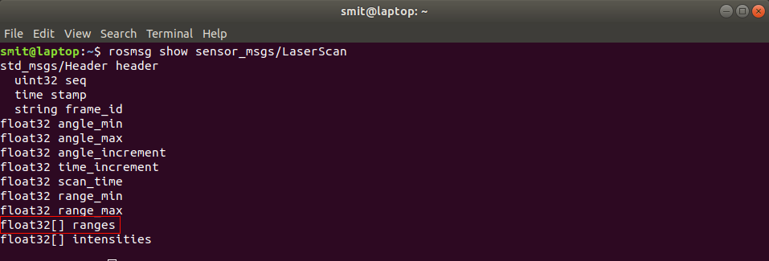
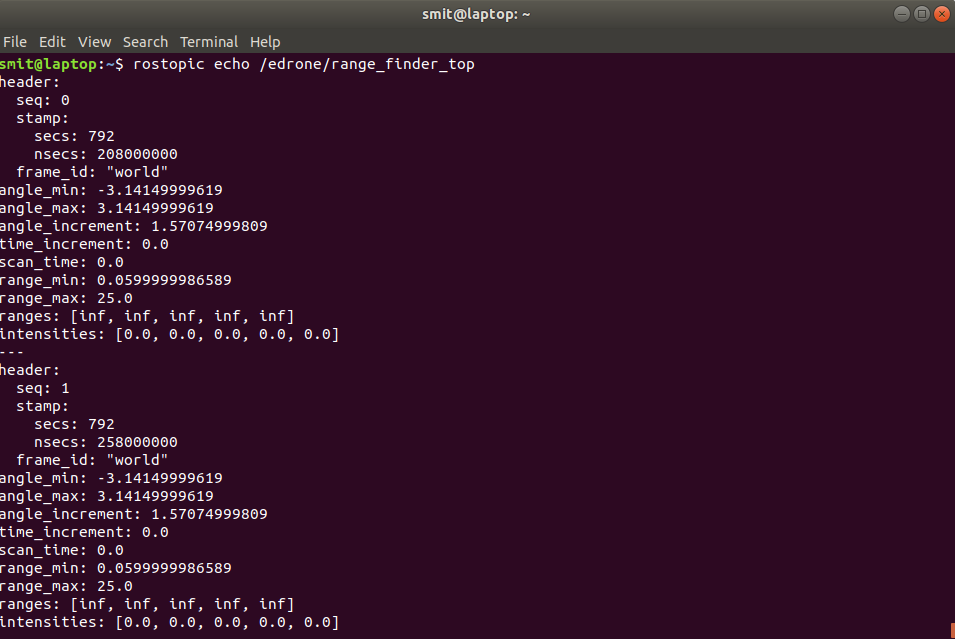
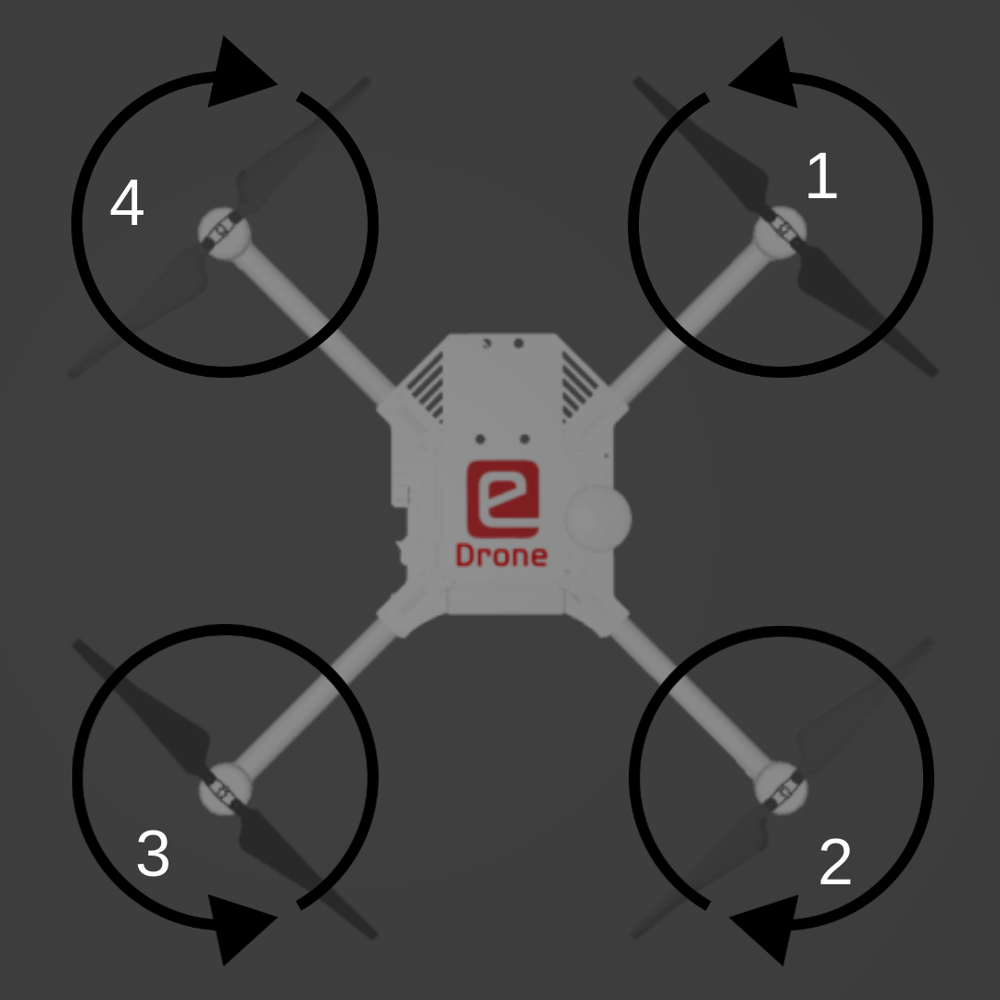

# Exploring eDrone ROS-Gazebo model

In this section, we will explore the sensors & actuators present on eDrone and how to get the values from sensors and give command the rotate the propellers.

## Sensors

### Inertial Measurement Unit (IMU)

  - An Inertial Measurement Unit (IMU) is an electronic device that measures and reports a body's specific force, angular rate, and sometimes the orientation of the body, using a combination of accelerometers, gyroscopes, and sometimes magnetometers. IMUs are typically used to maneuver aircraft including unmanned aerial vehicles (UAVs).

  - Typically complex filtering techniques are used to estimate the orientation and heading of the aircraft by fusing readings from all the above mentioned sensors. The filtering techniques are beyond the scope of this task.

  - The eDrone also has an IMU which directly publishes the filtered data ie. the orientation and heading of the eDrone over a rostopic named `/edrone/imu/data`.

  - To check the IMU data being published from the sensor, you can first launch the gazebo world with eDrone using the command in previous section and then to get sensor data, type the following command.

  ```bash
  rostopic echo /erone/imu/data
  ```
  

  - Bonus: If you want to get the info of the topic `/edrone/imu/data` then type

  ```bash
  rostopic info /edrone/imu/data
  ```
  

  As you can see, the msg type used by this rostopic is `sensor_msgs/Imu`
  To get more info about the msg type, use the command

  ```bash
  rosmsg show sensor_msgs/Imu
  ```
  

  - To know the rate at which the IMU sensor in gazebo publishes data, you can type

  ```bash
  rostopic hz /edrone/imu/data
  ```
  

### Global Positioning System sensor (GPS sensor)

  - GPS sensors are receivers with antennas that use a satellite-based navigation system with a network of multiple satellites in orbit around the earth to provide position, velocity, and timing information.

  - However a GPS sensor on eDrone is simulated in gazebo which publishes the latitude, longitude and altitude data along with other data but we are concerned about the position of the eDrone ie, latiude, longitude and altitude.

  - The GPS sensor of eDrone publishes data on the topic `/edrone/gps`.

  - To get check the data being published by the `/edrone/gps` topic, type

  ```bash
  rostopic echo /edrone/gps
  ```
  

  - To get more info of the topic, msg type and update rate of /edrone/gps you can follow the similar steps as explained in the IMU section.

### Range finder-Bottom

  - Usually UAV's or drones have a range finder (usually SONAR or LiDAR) at the bottom that measures the distance of the drone from the ground/obstacle.

  - The eDrone also has a bottom facing range finder to measure the distance of eDrone from the ground.

  **NOTE**: The altitude reading from the GPS sensor is above the sea level or you can consider it as the altitude with reference to global co-ordinate system. Let us consider a case when the eDrone is exactly 1m above a building that is 10m tall, the GPS altitude will give the reading of 11m whereas the range finder will give the actual distance of the obstacle (terrace of the building) from the eDrone.

  - The range finder at the bottom publishes ROS messages on the topic `/edrone/range_finder_bottom`

  - To get check the data being published by the `/edrone/range_finde_bottom` topic, type

  ```bash
  rostopic echo /edrone/range_finder_bottom
  ```
  

  - To get more info of the topic, msg type and update rate of `/edrone/range_finder_bottom` you can follow the similar steps as explained in the IMU section.

  - You will be accessing the ROS messages using your python scripts. The msg files are like packets with many variables of different data types. The msg sensor_msgs/LaserScan has a variable array named ranges, this is an array of float data type. Use this information while you implement your tasks.
  

### Range finder-top

  - Some autonomous UAV's or drones have range finders facing front, right, back and left to detect any obstacle and avoid collision.

  - Some autonomous UAV's or drones have range finders facing front, right, back and left to detect any obstacle and avoid collision.

  - The range finder is placed at the top and hence lets call it as range finder-top to distinguish from the range finder-bottom.

  - The range finder-top publishes ROS messages on the topic `/edrone/range_finder_top`

  - To get check the data being published by the `/edrone/range_finde_top` topic, type

  ```bash
  rostopic echo /edrone/range_finder_top
  ```
  

## Actuators

### Motors and propellers

  - The eDrone has 4 propellers attached to 4 different motors.

  - Two motors spin in clockwise direction and two motors spin in counterclockwise direction.
  

  - The motors used in real drones are usually Brush-less DC (BLDC) motors which are driven by Electronic Speed Controllers (ESC's). 

  - The flight controller present on the drones send the data to the ESC's in the form of Pulse Width Modulated (PWM) signals, however the motors used on eDrone are simulated but still to keep the experience of the simulation realistic, the eDrone model also communicates in PWM format of 10 bits, which means, you can set the speed of motors by sending data ranging from 0 to 210 - 1 ie. 0 to 1023.

  - The eDrone accepts the PWM values for setting the speed of motors over the rostopic `/edrone/pwm`

  - To know more about the topic and message types, use 

  ```bash
  rostopic info /edrone/pwm
  ```

  ```bash
  rosmsg show vitarana_drone/prop_speed
  ```

  - Now lets try to fly the eDrone by publishing the PWM values for the speed of 4 motors by typing

  ```bash
  rostopic pub /edrone/pwm vitarana_drone/prop_speed "prop1: 512.0
prop2: 512.0
prop3: 512.0
prop4: 512.0" 
  ```
  Voila, you just made the eDrone fly ! 

  Now experiment publishing different and unequal values to the propellers and observe how the eDrone performs rotation in Roll and Pitch axes.

## Tip

  - If you want to see the IMU, GPS, Range finder's or Camera readings while you move the eDrone's position and orientation, use the static parameter to launch the eDrone

  ```bash
  roslaunch vitarana_drone drone.launch static:='static'
  ```

  This will disable gravity and you can play around with the eDrone and observe the readings, this will be helpful to interpret the sensor's readings for roll, pitch, lattitude, longitude, altitude etc.

<hr>